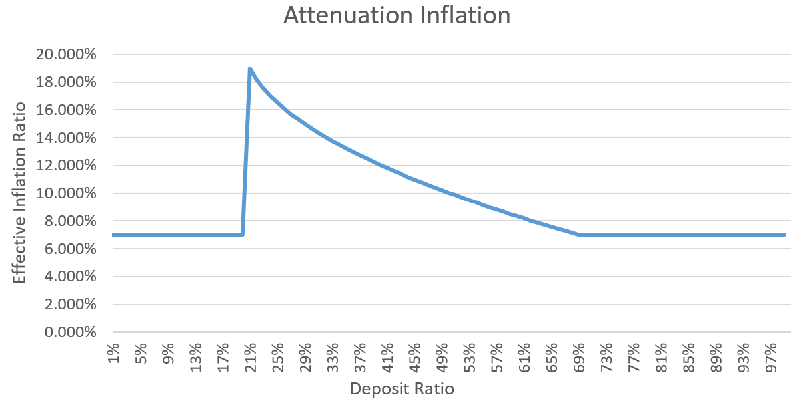

# [Ring Network](https://ringnetwork.org)经济模型

Ring Network代币符号为“RNG”，于2018年1月18日完成初始发行，初始发行总量为5亿枚RNG。
系统经过一年多的平稳运行，[浏览器](https://explorer.ringnetwork.org)显示初始发行的RNG目前已遍布在5万余个账户地址中，其中：

- 67.5% 外部流通
- 28.0% 基金会和合作伙伴共同管理
- 7.5% 团队激励锁仓

挖矿开启后，将逐渐释放另外5亿枚RNG，最终发行总量不超过10亿枚RNG。增发的RNG作为Ring Network去中心化运转的经济激励，使矿工节点自主维护全账本并为其它节点提供账本相关服务。为此，我们谨慎提出Ring Network经济模型。

新增发的RNG按照以下比例进行分配：
- 60% 以“公证收益”的形式分配给该轮次的公证人；
- 30% 以“抵押收益”的形式分配给参与押金合约抵押的地址；
- 10% 分配给基金会，用于系统维护和后期开发等。

押金合约是用户创建的特殊的条件支付脚本，它是Ring Network经济模型运转的重要基础，主要作用：
- 确定每个轮次的增发量
- 确定抵押收益的分配方式
- 降低超级节点的PoW难度

押金合约中包含两个地址，一个是可花费押金的安全地址，另一个是区别于其它合约的特殊地址（BURNEDRNG2222222222222222L3HXT4Y）。特殊地址是根据地址基本验证规则反向生成的，该地址无法用于生成交易，安全地址是唯一能花费押金合约中抵押代币（RNG）的地址。

## 1. 增发规则
轮次是Ring Network新增的概念，系统以平均300秒（5分钟）为一个运行周期，该周期称为“轮次”。

除初始轮次（创世后的首轮）外，每个轮次都会根据**当前发行总量**和**当前抵押总量**计算出**当前抵押率**，并根据**当前抵押率**计算**当前轮次增发量**。具体计算公式如下：

- 当前发行总量 = 初始发行量 + 历史轮次的增发量总额 – 历史交易的手续费总额
- 每年增发轮次 = (365 * 24 * 60 * 60) / 300 = 105210
- 当前抵押率 = 当前抵押总量 / 当前发行总量
- 等效年化通胀率 = 
  - 0.07, if 当前抵押率 >= 69%
  - 0.21 - 0.2* ((当前抵押率-0.2) ^ 0.5), if 20% < 当前抵押率 < 69%
  - 0.07, if 当前抵押率 <= 20%
- 当前轮次增发量 = (当前总发行量 * 等效年化通胀率) / 每年增发轮次

## 2. 公证人收益
公证人收益是超级节点（Super Node）通过工作量证明（Proof of Work，PoW）竞选成为公证人并履行公证人职责后获得的收益。公证人收益计算规则如下：
- 每个轮次有10位公证人，这些公证人通过拜占庭协商协议共同生成TrustME单元。
- 每个TrustME单元中含有7个公证人的签名。
- 某轮次结束后，统计该轮次内生成的所有TrustME单元中各公证人签名出现的频次，进而推算出共识参与度，并以此计算各公证人的公证收益。
  - 某公证人的公证收益 = 当前轮次增发量 * 60% * 共识参与度
- 公证收益以Coinbase的形式分发给各公证人对应押金合约的安全地址。

## 3. 抵押收益
根据押金合约中抵押的RNG数量和币龄（合约地址的UTXO存在的轮次数）计算押金权益，以此分配30%的RNG增发量。抵押收益计算规则如下:
- 币龄 = (押金合约地址UTXO持续的轮次数 - 576 ) / 576
  - 若 币龄 < 0，则记为 0
- 押金合约权益值 = Math_Sum(押金合约地址的UTXO * 该UTXO的币龄)
- 押金合约权益占比 = 押金合约权益值 / 所有押金合约权益值之和
- 押金合约抵押收益 = 未兑付总抵押收益 * 押金合约权益占比

**押金收益每576轮次兑付一次。**

## 4. PoW难度调整
根据全网算力情况动态调整每轮次PoW的标准难度，以使每轮次的平均持续时间接近设计值（150秒）。

需要特别强调的是，**超级节点抵押RNG将降低其自身的PoW难度**，押金合约中除了可以指定安全地址，还可以指定Coinbase地址，实现超级节点无币运行，确保超级节点资金安全。

| Deposit(RNG) | Difficulty Shift Left |
| :----------: | :------: |
|0 | 0 |
|4404 | 1 |
|10747 | 2 |
|19885 | 3 |
|33046 | 4 |
|52003 | 5 |
|79309 | 6 |
|118640 | 7 |
|175292 | 8 |
|256894 | 9 |
|374434 | 10 |
|543737 | 11 |
|787601 | 12 |
|1138862 | 13 |
|1644817 | 14 |
|2373592 | 15 |
|3423319 | 16 |
|4935341 | 17 |
|7113253 | 18 |
|10250311 | 19 |
|14768919 | 20 |
|21277507 | 21 |
|30652455 | 22 |
|44156101 | 23 |
|63606709 | 24 |
|91623300 | 25 |
|131978308 | 26 |
|190105530 | 27 |
|273831792 | 28 |
|394430828 | 29 |
|568141287 | 30 |
|818353267 | 31 |

上表中，左列表示押金合约中的RNG数量，右列表示押金数量对应的PoW难度过滤器最大左移数量。经过调整后的超级节点实际PoW难度不低于设计的最小PoW难度。

## 5. 交易手续费
### 手续费计算
- 特殊单元，如：PoW单元、TrustME单元和Coinbase单元，无手续费。
- 普通单元手续费计算公式：
### 手续费分配
- 第一阶段：挖矿启动早期，交易手续费直接销毁（burn），不再做二次分配，发行总量会做相应扣减。
- 第二阶段：挖矿运行一段时间之后，可通过超级节点投票决定交易手续费如何分配。

