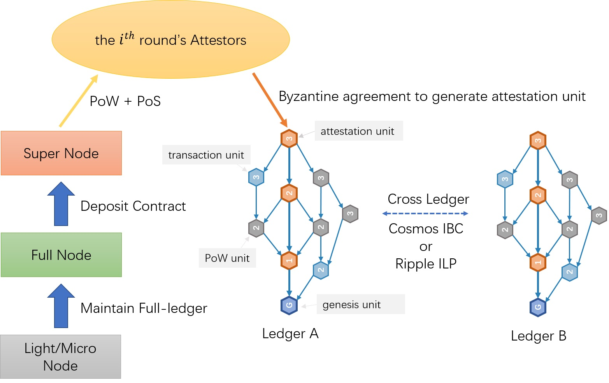
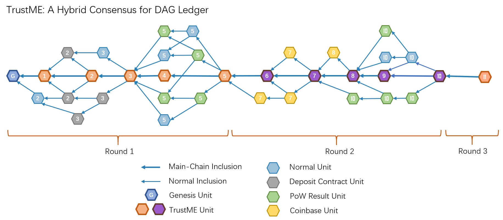

# TrustME-Hybrid
TrustME-Hybrid是一种适应与DAG账本系统的去中心化共识机制。
根据DAG独有的单元自由引用、单元生成即入账本、记账权与公证权分离、公证人权利弱化等性质，将Proof of Work（PoW）、Proof of Stake（PoS）和BFT三种共识方式高效融合到DAG账本技术。

TrustME-Hybrid共识机制为DAG账本系统带来以下优势：
- 公证人按轮次更换，打破DAG中心化的魔咒
- 更好的平衡高算力节点和持币大户节点之间的利益分配，吸引更多节点参与维护全账本
- 不破坏DAG性质，共识逻辑简单，充分发挥DAG可扩展性
- 最终确定性，非概率性共识，公证单元生成后立即稳定，其直接或间接引用的单元也随之立即稳定，无交易回滚和撤销，完全抵御51%算力攻击
- 多公证人之间进行拜占庭协商，抵御网络分区攻击，防止共识冲突或分叉

## 工作原理

  

- PoW：超级节点通过PoW竞选设定的公证人席位，通过动态调整挖矿标准难度，确定公证人轮次切换的平均时间间隔。

- PoS：超级节点创建押金合约并抵押token，可根据当前轮次的PoW标准难度和押金合约中token数量计算超级节点的实际PoW难度。超级节点可以在押金合约中指定安全地址和Coinbase地址，确保资金安全。

- BFT：公证人根据经过优化的Tendermint BFT协议协商生成TrustME公证单元，公证单元生成即可稳定，缩短普通交易单元的确认时间。

## 基本概念
- 单元：节点将各种链上行为封装成单元，如发送交易、记录数据、触发合约、token兑换等，并且多个非关联行为可被封装在一个单元中。
  - 引用：
    单元除包含节点行为，还记录单元之间可继承的信任关系。节点在新生成的单元时需要验证并引用之前的单元，引用即确认。
    单元之间的引用关系表明链上行为发生的先后顺序，是交易排序的重要基础。
  - 类型：
    - 普通单元：由任意节点生成，包含普通链上行为。
    - 特殊单元/共识单元：由超级节点（SuperNode）在不同情况下生成。
      - PoW单元：超级节点在挖矿成功后生成PoW单元，当选为下个轮次的公证人。公证人选举按轮次进行，每轮选出的公证人数量到达设计值时，触发公证人集体更换，并同时触发下一轮公证人选举，即：第i轮的公证人是在第(i-1)轮竞选出来的，第i轮进行中还在选举第(i+1)轮的公证人。
      - TrustME单元：当前轮次的公证人通过拜占庭协商方式生成TrustME单元，被TrustME单元直接或间接引用的单元都会稳定，这些单元中的所有链上行为将被确认。
      - Coinbase单元：发生轮次更换后，超级节点计算自身在上一个轮次中以公证人身份执行的有效公证行为，以此为基础计算自己应得Coinbase，并生成Coinbase单元。

## PoW
PoW基于抗ASIC的[Equihash](https://en.wikipedia.org/wiki/Equihash)算法实现。2016年，卢森堡大学的Alex Biryukov 和 Dmitry Khovratovich等人提出基于生日悖论问题的重度依赖内存访问（memory-hard）的PoW算法。目前，使用Equihash算法的公链包括：Zcash和Bitcoin Gold等。

Equihash算法参数：n=200、k=9、d=0，哈希算法：Blake2。

## BFT
RingNetwork拜占庭协商机制基于Gossip协议和Cosmos的[Tendermint BFT](https://arxiv.org/abs/1807.04938)算法，通过改造Tendermint BFT使其适应DAG账本并直接达成协商结果的最终性。

拜占庭协商过程是异步的，所有公证人权利对等，含四个步骤：
- Propose: 公证人轮流充当簇首并生成Proposal；
- Prevote: 接收并验证Proposal，并对其进行投票（赞成或反对）；
- Precommit: 如果收集到超过2/3的赞成票，则生成并广播“预确认”消息；
- commit: 如果收集到超过2/3的“预确认”消息，则所有公证人等待接收簇首生成的TrustME单元。

需要特殊说明的是：
1. 前三个步骤的超时时间是10秒，如果在一个phase内没有到达commit，则下一个phase的超时时间会增加1秒，并且会更换簇首。
2. 在commit步骤中，如果公证人不能在设定时间（1小时）内收到簇首生成的TrustME单元，意味着簇首节点或整个网络出现了比较严重的问题，所有公证人将退出拜占庭协商，等待轮次强制切换机制激活。设计此机制的目的是保证TrustME单元生成即稳定，避免稳定账本冲突。