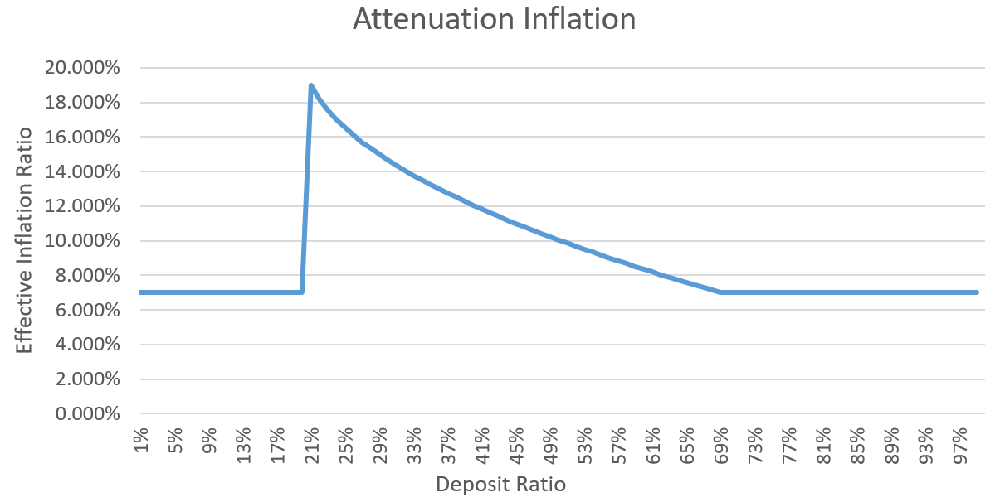

# [Ring Network](https://ringnetwork.org)（RNG）经济模型

Ring Network代币符号为“RNG”，于2018年1月18日完成初始发行，初始发行总量为5亿枚RNG。
系统经过一年多的平稳运行，[浏览器](https://explorer.ringnetwork.org)显示初始发行的RNG目前已遍布在5万余个账户地址中，其中：

- 67.5% 外部流通
- 28.0% 基金会和合作伙伴共同管理
- 7.5% 团队激励锁仓

挖矿开启后，将逐渐释放另外5亿枚RNG，最终发行总量不超过10亿枚RNG。增发的RNG作为Ring Network去中心化运转的经济激励，使矿工节点自主维护全账本并为其它节点提供账本相关服务。为此，我们谨慎提出Ring Network经济模型。

## 增发规则
轮次是Ring Network中新增的重要概念，系统平均以150秒（2.5分钟）为一个运行周期，该周期称为“轮次”。

除初始轮次（创世后的首轮）外，每个轮次都会根据**当前发行总量**和**当前抵押总量**计算出**当前抵押率**，并根据**当前抵押率**计算**当前轮次增发量**。具体计算公式如下：

- 当前发行总量 = 初始发行量 + 历史轮次的增发量总额 – 历史交易的手续费总额
- 每年增发轮次 = (365 * 24 * 60 * 60) / 150 = 210420
- 当前抵押率 = 当前抵押总量 / 当前发行总量
- 等效年化通胀率 = 
  - 0.07, if 当前抵押率 >= 69%
  - 0.21 - 0.2* ((当前抵押率-0.2) ^ 0.5), if 20% < 当前抵押率 < 69%
  - 0.07, if 当前抵押率 <= 20%
- 当前轮次增发量 = (当前总发行量 * 等效年化通胀率) / 每年增发轮次

## 增发分配方式
确定当前轮次增发量后，增发的RNG按照以下比例进行分配：
- 60% 以“公证收益”的形式分配给该轮次的公证人
- 30% 以“抵押收益”的形式分配给所有参与抵押的用户地址
- 10% 以“基础服务费”的形式分配给基金会

## 公证收益
公证收益是指分配给公证人的收益。
超级节点（Super Node）是拥有公网IP并维护全账本的节点，它们以工作量证明（Proof of Work，PoW）的方式参与公证人竞选。每个轮次会从超级节点中选出10个节点成为公证人，并根据公证人参与共识的实际情况计算每个公证人的公证收益。

## 抵押收益
用户（包括超级节点）可以抵押RNT并获得抵押收益。

### 押金安全
押金存放在用户创建的押金合约中，并且用户可以在合约中指定安全地址，只有安全地址可以花费该合约的押金。

### 抵押收益计算方法
- 押金抵押后，当日开始计算收益，抵押收益每7天兑付一次。
- 押金花费后，花费当日及花费前3日不计算收益。
- 抵押收益计算公式：
  - 押金币龄 = 押金数量 * 持续抵押时间
  - 押金币龄比率 = 押金币龄 / 总押金币龄
  - 押金收益 = 总抵押收益 * 押金币龄比率

## PoW难度调整
根据全网算力情况动态调整每轮次PoW的标准难度，以使每轮次的平均持续时间接近设计值（150秒）。

需要特别强调的是，**超级节点抵押RNG将降低其自身的PoW难度**，押金合约中除了可以指定安全地址，还可以指定Coinbase地址，实现超级节点无币运行，确保超级节点资金安全。

| Deposit(RNG) | Difficulty Shift Left |
| :----------: | :------: |
|0 | 0 |
|4404 | 1 |
|10747 | 2 |
|19885 | 3 |
|33046 | 4 |
|52003 | 5 |
|79309 | 6 |
|118640 | 7 |
|175292 | 8 |
|256894 | 9 |
|374434 | 10 |
|543737 | 11 |
|787601 | 12 |
|1138862 | 13 |
|1644817 | 14 |
|2373592 | 15 |
|3423319 | 16 |
|4935341 | 17 |
|7113253 | 18 |
|10250311 | 19 |
|14768919 | 20 |
|21277507 | 21 |
|30652455 | 22 |
|44156101 | 23 |
|63606709 | 24 |
|91623300 | 25 |
|131978308 | 26 |
|190105530 | 27 |
|273831792 | 28 |
|394430828 | 29 |
|568141287 | 30 |
|818353267 | 31 |

