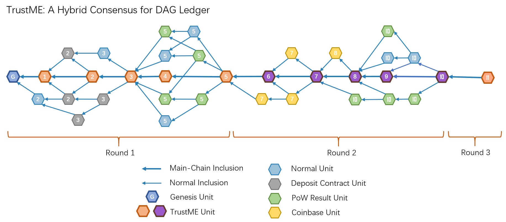
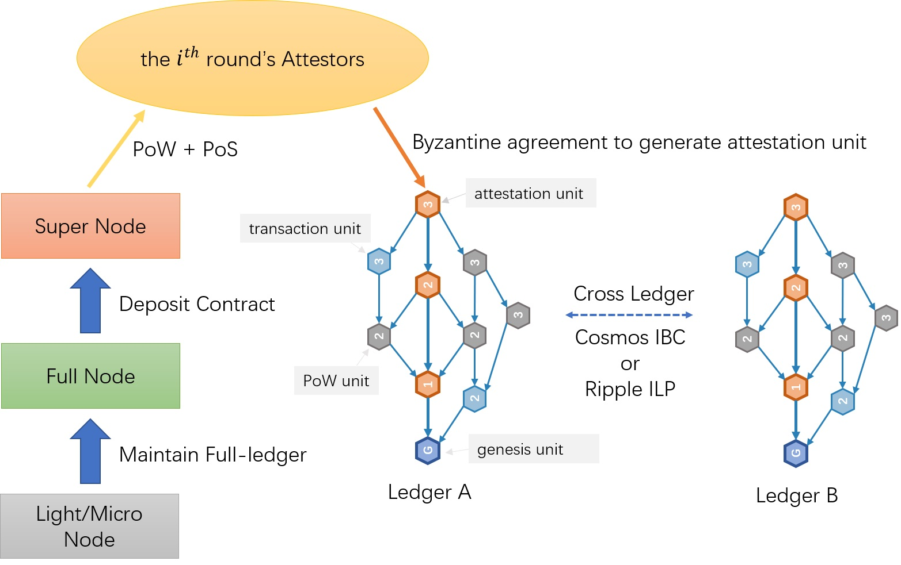

# TrustME-Hybrid Consensus Mechanism
TrustME-Hybrid共识机制将PoW、PoS和Tendermint BFT三者融合到DAG账本技术中，实现DAG账本系统去中心化，共识机制简单高效，提供直接的最终确定性。

- 单元引用：交易被封装成单元，新生成的单元需要验证并引用历史单元，单元的引用关系即为交易顺序。

- PoW：超级节点通过PoW竞选设定的公证人席位，通过动态调整挖矿标准难度，确定公证人轮次切换的平均时间间隔。

- PoS：超级节点创建押金合约并抵押token，可根据当前轮次的PoW标准难度和押金合约中token数量计算超级节点的实际PoW难度。超级节点可以在押金合约中指定安全地址和Coinbase地址，确保资金安全。

- BFT：公证人根据经过优化的Tendermint BFT协议协商生成TrustME公证单元，公证单元生成即可稳定，缩短普通交易单元的确认时间。

